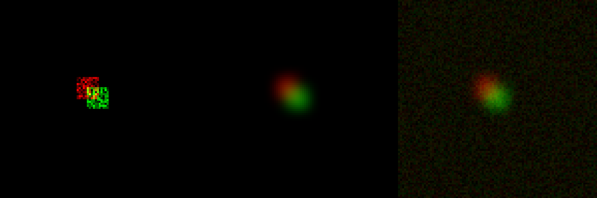
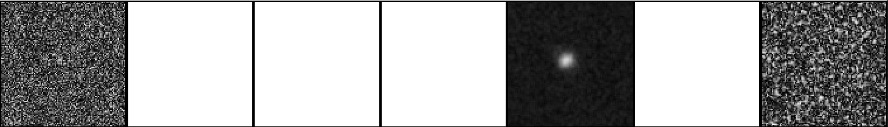
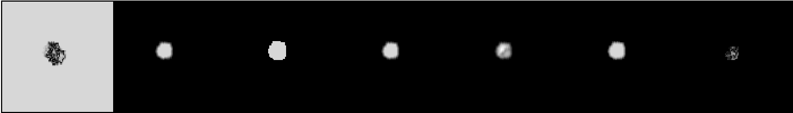

# Colocalization

A Julia package providing colocalization metrics for images and their sparse representations.

This package allows you to quickly run all metrics, and report the results both in image and CSV format.

Colocalization is used often in multichannel microscopy to quantify functional interaction between fluorescently marked proteins or subcellular organelles.
Note that colocalization in superresolution microscopy has to be very carefully applied, as with increasing precision no two objects can share the same location at the same time.

[](https://dl.circleci.com/status-badge/redirect/gh/bencardoen/Colocalization.jl/tree/main) [](https://codecov.io/gh/bencardoen/Colocalization.jl) [](https://doi.org/10.5281/zenodo.7552357)

## Table of contents
1. [Installation](#install)
2. [Usage](#usage)
  -  [Supported Metrics](#metrics)
  -  [Demo](#demo)
3. [Cite](#cite)
4. [Related projects and tools](#tools)


<a name="installation"></a>
## Installation
- Download [Julia](https://julialang.org/learning/getting-started/)


### Using as a package
Start Julia (in VSCode or Command line)
```bash
julia
```
In Julia
```julia
using Pkg
# Optionally, activate your environment
# Pkg.activate("path/to/your/environment")
Pkg.add(url="https://github.com/bencardoen/Colocalization.jl")
using Colocalization
```

### Cloning the repository
```bash
git clone https://github.com/bencardoen/Colocalization.jl.git
cd Colocalization.jl
julia --project=.
```
in Julia
```julia
using Pkg
Pkg.instantiate()
using Colocalization
```
That's it.

#### On Command line
Let's say you have 2 image files `a.tif` and `b.tif`.
```
julia --project=. scripts/colocalize.jl -f a.tif -s b.tif --outdir . --segment -w 3
```

<a name="usage"></a>
## Usage

<a name="metrics"></a>
### Supported Metrics 

You can get an up to date listing of the supported metrics by running the following code:
```julia
using Colocalization, Logging
@info list_metrics()
```
or access the actual functions:
```julia
for (name, metric) in metrics_iterator()
  @info name, metric
end
```

<a name="demo"></a>
### In silico example

Let's create 2 objects with variable levels of fluorescence labelling, that overlap by 50%.
```julia
using Images, Statistics, Distributions, Colocalization, ImageFiltering, Random
X, Y = 100, 100
xs = zeros(X, Y)
ys = zeros(X, Y)
xs[40:50, 40:50] .= rand(11, 11)
ys[45:55, 45:55] .= rand(11, 11)
sx = ImageFiltering.imfilter(xs, ImageFiltering.Kernel.gaussian((3, 3)))
sy = ImageFiltering.imfilter(ys, ImageFiltering.Kernel.gaussian((3, 3)))
```
We'll add some noise to make things realistic
```julia
s2x = copy(sx)
s2y = copy(sy)
s2x .+= rand(100, 100) ./ 10
s2y .+= rand(100, 100) ./ 10
```
View the results
```julia
using SPECHT, ImageView
imshow(mosaicview( [SPECHT.tcolors([xs, ys]), SPECHT.tcolors([sx, sy]), SPECHT.tcolors([s2x, s2y])], nrow=1))
```

The visualzaition snippet uses SPECHT and Imageview, if you don't have them:
```julia
using Pkg
Pkg.add("ImageView")
Pkg.add(url="https//github.com/bencardoen/SPECHT.jl")
```

This should produce something like this image



Now, we compute all coloc metrics
```julia
results = colocalize_all(s2x, s2y)
```
Let's view the results, the metrics from left to right are: `spearman, m2, m1, jaccard, manders, sorensen, pearson`
```
mv = mosaicview([abs.(results[k]) for k in keys(results)], nrow=1)
imshow(mv)
```



Clearly, the noise is throwing a wrench in things. Metrics like Jacard, M1 and so forth expect segmented images to work on.
Let's do a quick segmentation.
```julia
xt = otsu_threshold(s2x)
yt = otsu_threshold(s2y)
s2x[s2x.<xt] .= 0
s2y[s2y.<yt] .= 1
results = colocalize_all(s2x, s2y)
mv = mosaicview([abs.(results[k]) for k in keys(results)], nrow=1)
imshow(mv)
```
Which should produce something like the below image.


You can pass parameters, such as windowsize (default 3x3) to the function, please see their docstrings:
```julia
using Colocalization
?colocalize_all
```

 <a name="cite"></a>
## Cite
If you find this useful, consider citing:
```bibtext
@software{ben_cardoen_2023_7552357,
  author       = {Ben Cardoen},
  title        = {Colocalization.jl},
  month        = jan,
  year         = 2023,
  publisher    = {Zenodo},
  doi          = {10.5281/zenodo.7552357},
  url          = {https://doi.org/10.5281/zenodo.7552357}
}
```

**Note** For the individual metrics, please cite the introducing author!!!.

<a name="faq"></a>
## FAQ
- To display the images, you need to install ImageView
```julia
using Pkg
Pkg.add("ImageView")
```

 <a name="related"></a>
## Related software
FiJi:
- [https://imagej.net/plugins/coloc-2](https://imagej.net/plugins/coloc-2)
- [https://github.com/fiji/Colocalisation_Analysis](https://github.com/fiji/Colocalisation_Analysis)
